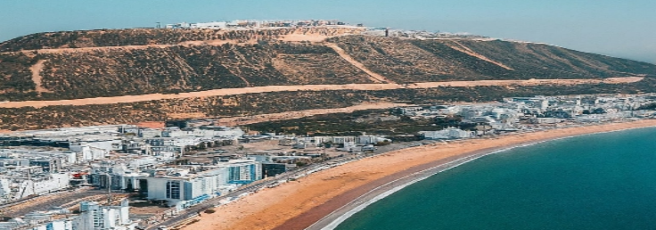

# Introduction

 *Figure 1: Introduction*
<!--  -->

<!-- note -->

Agadir is a beautiful resort city located on the southern coast of Morocco. It is known for its stunning beaches, delicious food, and friendly people. Agadir is a great place to relax and enjoy the Moroccan sunshine.

<!-- new slide -->